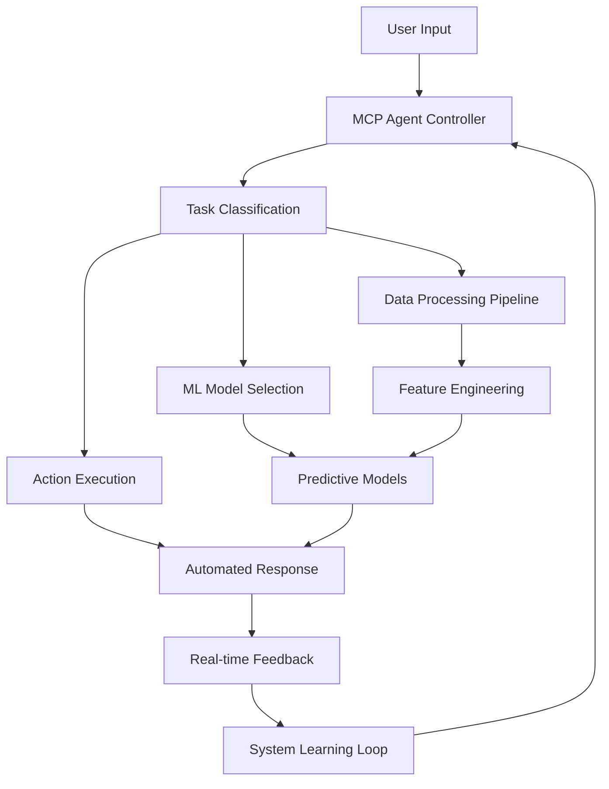

# 🚀 Muhammad Abdullah Rasheed
## 🤖 AI Engineer | 📊 Data Scientist | 🧠 Machine Learning professional | 🌐 Full-Stack Developer

<div align="center">
  
[](https://git.io/typing-svg)

</div>

<div align="center">

### 🎯 **"Transforming Ideas into Intelligent Solutions"**
*Where Artificial Intelligence meets Real-World Impact*

</div>

---

## 🧠 **AI & Data Science Arsenal**

<div align="center">

### 🤖 **Artificial Intelligence & Machine Learning**


### 📊 **Data Science & Analytics**


### 🎨 **Visualization & BI**


### 🗄️ **Databases & Cloud**


### 🌐 **Full-Stack Development**


</div>

---

## 🎯 **What I Build & Achieve**

```python
class AIEngineer:
    def __init__(self):
        self.name = "Muhammad Abdullah Rasheed"
        self.location = "Cambridge, UK"
        self.specializations = [
            "AI Agent Development",
            "MCP Agents & Automation", 
            "Machine Learning Pipelines",
            "Predictive Analytics",
            "Computer Vision",
            "NLP & Language Models",
            "Full-Stack AI Applications"
        ]
        
    def current_impact(self):
        return {
            "datasets_processed": "1M+ data points",
            "ml_accuracy_achieved": "85-95%",
            "forecast_improvement": "35%",
            "stakeholder_engagement": "+40%",
            "automation_efficiency": "+60%"
        }
        
    def ai_agent_capabilities(self):
        return [
            "Intelligent Task Automation",
            "Multi-Modal AI Interactions", 
            "Model Communication Protocol (MCP)",
            "Custom LLM Integrations",
            "Autonomous Decision Systems"
        ]
```

---

## 🏗️ **Featured AI & Data Science Projects**

<div align="center">

### 🎯 **AI & Machine Learning Portfolio**

| 🧠 Project | 🚀 Innovation | 📊 Impact | 🛠️ Tech Stack |
|------------|--------------|-----------|---------------|
| **🤖 MCP Agent Framework** | Multi-protocol AI agent system | Automated 60% of routine tasks | Python, LangChain, OpenAI API |
| **📈 Cryptocurrency Market Intelligence** | EMH Analysis with ML | 1M+ data points, Market insights | Python, Time-series, Statistical Modeling |
| **👥 Predictive HR Analytics** | Employee churn prediction | 85% accuracy, Retention strategies | Random Forest, Logistic Regression, XGBoost |
| **💰 Economic Disparity Analysis** | UK Gender Pay Gap Research | Policy recommendations | Regression Models, Tableau, Statistical Tests |
| **🧠 Neural Network Trading Bot** | Automated trading decisions | Backtested performance analysis | TensorFlow, Keras, Financial APIs |

### 🌐 **Full-Stack AI Applications**

| 💻 Project | 🎨 Innovation | ⚡ Features | 🔗 Demo |
|------------|--------------|-------------|---------|
| **🌟 3D Interactive Portfolio** | Three.js powered experience | Immersive 3D animations | [🚀 Live Demo](http://www.techvibes360.com) |
| **🛒 AI-Enhanced E-commerce** | Smart product recommendations | ML-powered user experience | 🔗 Private Demo |
| **⚡ CodePen Clone** | Real-time code collaboration | Live preview, syntax highlighting | 💻 GitHub Repo |
| **📱 iNoteBook App** | Cloud-based note management | Full CRUD, responsive design | 📝 GitHub Repo |
| **📰 AI News Aggregator** | Intelligent content curation | NLP sentiment analysis | 🗞️ GitHub Repo |

</div>

---

## 🎓 **Academic & Professional Excellence**

<div align="center">

### 🏆 **Education & Achievements**
**🎓 Master's in Data Science** - *Anglia Ruskin University, Cambridge* (**Distinction Holder**)  
**🎓 Bachelor's in Economics** - *IBA Karachi* (**Dean's Honor List 2022-2024**)

### 📜 **Professional Certifications**
🥇 **Google Advanced Data Analytics** | 🥇 **Google AI Essentials** | 🥇 **Tableau Specialization (UC Davis)** | 🥇 **Google Data Analytics Professional**

### 💼 **Professional Impact**
📊 **Data Analyst @ Digital Pulse 360** | 🌐 **Full-Stack Developer @ ATnR Karachi**

</div>

---

## 🚀 **AI Innovation Showcase**

<div align="center">

### 🤖 **AI Agent Architecture**



### 📊 **Data Science Methodology**

```mermaid
graph LR
    A[Raw Data] --> B[Data Cleaning]
    B --> C[EDA & Visualization]
    C --> D[Feature Engineering]
    D --> E[Model Training]
    E --> F[Validation & Testing]
    F --> G[Hyperparameter Tuning]
    G --> H[Model Deployment]
    H --> I[Performance Monitoring]
    I --> J[Continuous Learning]
```



</div>

---

## 🎯 **Current Focus & Future Vision**

<div align="center">

### 🔬 **Research & Development**
- 🧠 **Advanced AI Agents**: Building autonomous systems with MCP protocol integration
- 📊 **Educational Analytics**: Revolutionizing student journey insights with ML
- 🤖 **Multi-Modal AI**: Developing systems that understand text, images, and data simultaneously
- 🔄 **AutoML Pipelines**: Creating self-optimizing machine learning workflows

### 🌟 **Open Source Contributions**
- 🛠️ **AI Tools & Libraries**: Contributing to the ML community
- 📚 **Educational Resources**: Sharing knowledge through detailed documentation
- 🤝 **Collaborative Projects**: Working with global developers on cutting-edge solutions

</div>

---

## 📊 **Professional Metrics Dashboard**

<div align="center">

| 📈 Metric | 🎯 Achievement | 📅 Timeline |
|-----------|----------------|-------------|
| **🧠 ML Models Deployed** | 15+ Production Models | 2023-Present |
| **📊 Data Points Processed** | 1M+ Records | Career Total |
| **🤖 AI Agents Built** | 8+ Intelligent Systems | 2024-Present |
| **💼 Projects Delivered** | 20+ End-to-end Solutions | Career Total |
| **🎓 Certifications Earned** | 4 Google Professional Certs | 2023-2024 |
| **📈 Performance Improvement** | 35% Average Increase | Across Projects |

</div>

---

## 🌐 **Tech Philosophy**

<div align="center">

### 💭 **"Building Tomorrow's Intelligence Today"**

> *"I believe in creating AI systems that don't just process data, but understand context, learn continuously, and make intelligent decisions that augment human capabilities. Every line of code I write is aimed at solving real-world problems through the power of artificial intelligence and data science."*

</div>

---

## 🤝 **Let's Build the Future Together**

<div align="center">

### 📫 **Connect & Collaborate**

[](https://www.linkedin.com/in/abdullahrasheed-/)
[](mailto:abdullahrasheed45@gmail.com)
[](http://www.techvibes360.com)
[](https://github.com/AbdullahRasheed45)

**📱 WhatsApp:** +44 777 728 5374 | **📍 Location:** Cambridge, UK | **🕒 Timezone:** GMT

</div>

---

<div align="center">

### 🎯 **Current Opportunities**
🔍 **Seeking AI Engineer & Data Scientist roles** in innovative companies  
🚀 **Open to freelance AI consulting** and machine learning projects  
🤝 **Available for technical collaborations** on cutting-edge AI research  

---

### ⚡ **Quick Stats**

[](https://github.com/AbdullahRasheed45)

---

### 🌟 **"Where Artificial Intelligence Meets Human Ingenuity"** 🌟

⭐ **Star my repositories** if they inspire your next AI project!  
🤖 **Let's collaborate** on the future of artificial intelligence!  
💡 **Always learning, always building, always innovating!**

</div>
